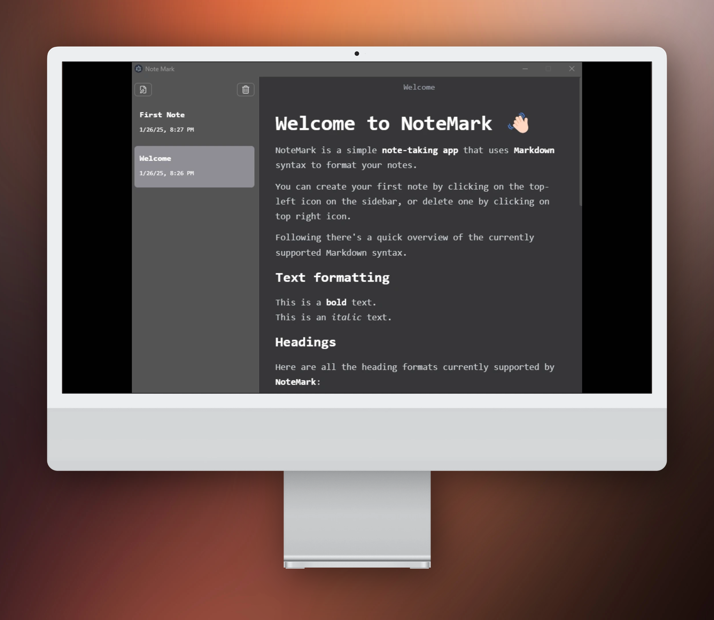

# NoteMark 📝

[](.)

A modern, minimalist Markdown note-taking application built with Electron, React, and TypeScript. NoteMark provides a seamless writing experience with real-time preview and automatic saving.

## ✨ Features

- 📝 Clean and intuitive Markdown editor
- 🔄 Real-time preview as you type
- 💾 Automatic saving (autosave after 3 seconds of inactivity)
- 🎨 Beautiful dark theme interface
- 🖥️ Cross-platform support (Windows, macOS, Linux)
- 📁 Local file system storage
- ⚡ Fast and lightweight

## 🛠️ Built With

- [Electron](https://www.electronjs.org/) - Cross-platform desktop framework
- [React](https://reactjs.org/) - UI framework
- [TypeScript](https://www.typescriptlang.org/) - Type-safe JavaScript
- [TailwindCSS](https://tailwindcss.com/) - Utility-first CSS framework
- [MDXEditor](https://mdxeditor.dev/) - Markdown editor component
- [Jotai](https://jotai.org/) - Atomic state management
- [electron-vite](https://electron-vite.org/) - Electron Build Tool

## 🚀 Getting Started

### Prerequisites

- Node.js 20.x or later
- yarn or npm

### Installation

- Clone the repository

```bash
git clone https://github.com/KhaledSaeed18/NoteMark.git
cd NoteMark
```

- Install dependencies

```bash
yarn
# or
npm install
```

- Start development server

```bash
yarn dev
# or
npm run dev
```

### Building

Build for your current platform:

```bash
yarn build
```

Platform-specific builds:

```bash
# Windows
yarn build:win

# macOS
yarn build:mac

# Linux
yarn build:linux
```

## 📝 Currently Supported Markdown Features

- **Text Formatting**
  - Bold text (`**bold**`)
  - Italic text (`_italic_`)
  
- **Headers**
  - H2 (`## Heading 2`)
  - H3 (`### Heading 3`)
  - H4 (`#### Heading 4`)
  
- **Lists**
  - Bulleted lists
  - Numbered lists
  
- **Blockquotes**
  - Single line quotes (`> quote`)
  
- **Code**
  - Inline code (`` `code` ``)
